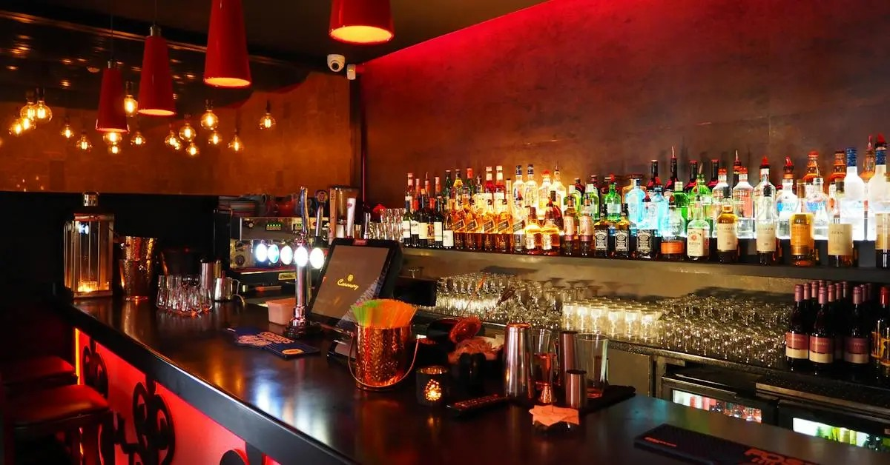
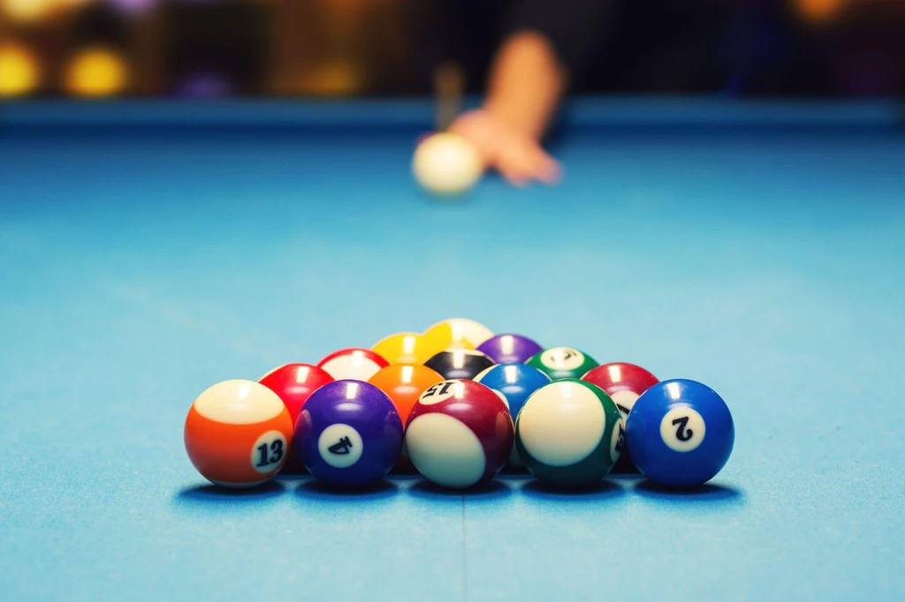
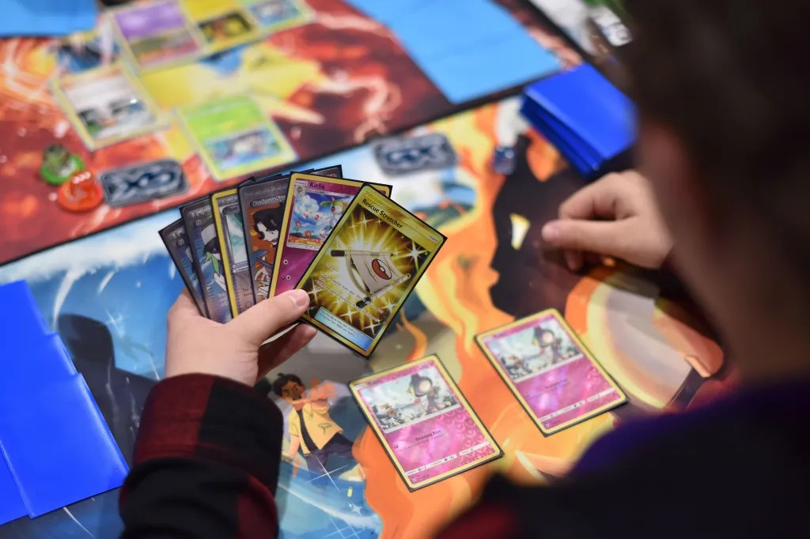

<html lang="en">
<body>
  <header>
    <h1>Services</h1>
  </header>

  <nav>
    <a href="README.md">Home</a>
    <a href="About.md">About</a>
    <a href="Services.md">Services</a>
    <a href="ContactInformation.md">Contact</a>
  </nav>

  <footer>
    <h2> Bar </h2>
      <h3>If We're Open, So Is The Bar!</h3>
        

        
    <h2> Pool </h2>
      <h3>APA, Private, or Recreational</h3>
        

        
    <h2> Gaming </h2>
      <h3>Private Events</h3>
        

      <h3>Competitive</h3>
        

        
    <h2> TCG (Casual and Competitive)</h2>
      <h3>Saturday Magic</h3>
        
On Saturdays, we will host Magic The Gathering from 12pm - 8pm. We will have deisgnated tables for 
          commander and standard formats. It is meant to be a casual atmosphere, however, bring your strongest 
          deck and start a high bracket table at your own risk! 

      <h3>Sunday Pokemon</h3>
        
On Sundays, we will host Pokemon from 12pm - 8pm. Same as magic, this is meant for a casual and fun atmosphere, however, you can get as 
      competitive as your group wants! We will have multiple tables set up for the TCG game, but we will also have tables designated for 
      trading and showing off your collections!

        
    <h2> Follow Our Socials </h2>
    <a href="https://www.facebook.com">Facebook</a>
    <a href="https://www.instagram.com">Instagram</a>
    <a href="https://www.tiktok.com/en/">TikTok</a>
  </footer>

</body>
</html>
